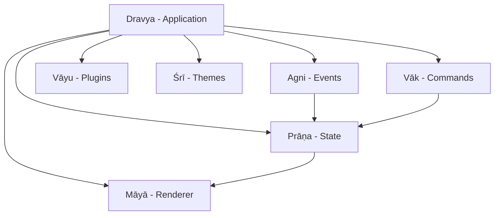

# Core Concepts

DRAV is built on several key concepts that work together to provide a powerful framework for terminal UIs.

## Architecture Overview



## Reactive State

Reactive state is at the heart of DRAV. When state changes, the UI automatically updates.

### Observables

Observables are reactive values that notify watchers when they change:

```go
// Create an observable
count := prana.NewObservable(0)

// Read the value
value := count.Get()

// Update the value
count.Set(10)

// Watch for changes
unwatch := count.Watch(func(old, new int) {
    fmt.Printf("Count changed: %d → %d\n", old, new)
})
defer unwatch()
```

### Computed Values

Computed values automatically update when their dependencies change:

```go
count := prana.NewObservable(5)

// This computed value updates automatically when count changes
doubled := prana.ComputedFromObservable(count, func(n int) int {
    return n * 2
})

fmt.Println(doubled.Get()) // 10

count.Set(7)
fmt.Println(doubled.Get()) // 14
```

### Stores

Stores manage complex state with actions and reducers:

```go
type AppState struct {
    User     string
    LoggedIn bool
}

store := prana.NewStore(AppState{})

// Register a reducer
store.RegisterReducer("LOGIN", func(state AppState, payload any) AppState {
    state.User = payload.(string)
    state.LoggedIn = true
    return state
})

// Dispatch an action
store.Dispatch(ctx, prana.Action{
    Type:    "LOGIN",
    Payload: "alice",
})

// Get current state
state := store.GetState()
```

## Event System

DRAV uses a priority-based event system for handling user input and system events.

### Event Types

- **KeyEvent**: Keyboard input
- **MouseEvent**: Mouse clicks and movement
- **ResizeEvent**: Terminal resize
- **TickEvent**: Periodic timers
- **CustomEvent**: Application-defined events

### Handling Events

```go
dispatcher := agni.NewDispatcher(1000, 10)

// Register event handler
unsubscribe := dispatcher.On(agni.EventTypeKey, func(ctx context.Context, event agni.Event) error {
    keyEvent := event.(*agni.KeyEvent)
    fmt.Printf("Key pressed: %c\n", keyEvent.Rune)
    return nil
}, agni.WithPriority(agni.PriorityHigh))

// Emit an event
dispatcher.Emit(ctx, agni.NewKeyEvent(agni.KeyRune, 'a', agni.ModNone, false))

// Cleanup
unsubscribe()
```

### Timers

Schedule one-shot or repeating timers:

```go
// One-shot timer
dispatcher.After(ctx, "timeout", 5*time.Second, func(ctx context.Context) {
    fmt.Println("5 seconds elapsed")
})

// Repeating timer
dispatcher.Every(ctx, "ticker", 1*time.Second, func(ctx context.Context) {
    fmt.Println("Tick")
})

// Cancel timer
dispatcher.CancelTimer("ticker")
```

## Component Model

Components are the building blocks of DRAV UIs.

### Creating Components

Implement the `Component` interface:

```go
type Counter struct {
    count *prana.Observable[int]
}

func (c *Counter) Render(ctx maya.RenderContext) maya.View {
    return maya.Column(
        maya.Text(fmt.Sprintf("Count: %d", c.count.Get())),
        maya.Text("Press + to increment"),
    )
}
```

### Functional Components

For simple components, use functional style:

```go
greeting := maya.Func(func(ctx maya.RenderContext) maya.View {
    return maya.Text("Hello, World!")
})
```

### Stateless Components

For static views:

```go
header := maya.Stateless(maya.Text("My App"))
```

## Layout System

DRAV provides a flexbox-inspired layout system.

### Basic Layouts

#### Row (Horizontal)

```go
maya.Row(
    maya.Text("Left"),
    maya.Text("Center"),
    maya.Text("Right"),
)
```

#### Column (Vertical)

```go
maya.Column(
    maya.Text("Top"),
    maya.Text("Middle"),
    maya.Text("Bottom"),
)
```

### Advanced Layouts

#### Grid

```go
grid := layout.NewGrid(2, 3) // 2 rows, 3 columns
items := []layout.GridItem{
    {Row: 0, Column: 0, RowSpan: 1, ColSpan: 1},
    {Row: 0, Column: 1, RowSpan: 1, ColSpan: 2}, // Spans 2 columns
}
rects := grid.Layout(items, width, height)
```

#### Flex

```go
flex := &layout.FlexLayout{
    Direction: layout.Row,
    Justify:   layout.JustifySpaceBetween,
    Align:     layout.AlignCenter,
    Gap:       2,
}
```

#### Stack (Overlapping)

```go
// Items are rendered on top of each other
maya.Stack(
    maya.Text("Background"),
    maya.Text("Foreground"),
)
```

## Rendering

DRAV uses a diff-based rendering algorithm for efficient updates.

### Render Cycle

1. **Component renders** to virtual view tree
2. **Diff algorithm** compares with previous frame
3. **Only changes** are written to terminal
4. **Double buffering** prevents flicker

### Performance

- **60 FPS target**: Frames rendered every ~16ms
- **Line-level hashing**: Quick dirty detection
- **Cell-level diff**: Minimal escape sequences
- **Damage tracking**: Only re-render changed components

## Command System

Built-in command palette with autocomplete and history.

### Defining Commands

```go
registry := vak.NewRegistry()

registry.Register(vak.Command{
    Name:    "save",
    Summary: "Save the current file",
    Usage:   "save [filename]",
    Flags: []vak.Flag{
        {Name: "force", Short: "f", Type: vak.FlagTypeBool},
    },
    Execute: func(ctx context.Context, args []string) (vak.Result, error) {
        // Save logic here
        return vak.SuccessResult("File saved"), nil
    },
    Undo: func(ctx context.Context) error {
        // Undo save (restore backup)
        return nil
    },
    Complete: func(prefix string) []string {
        // Return filename completions
        return []string{"file1.txt", "file2.txt"}
    },
})
```

### Executing Commands

```go
result, err := registry.Execute(ctx, "save file.txt --force")
if err != nil {
    log.Fatal(err)
}
fmt.Println(result.Message())
```

### History and Undo

```go
// Access history
history := registry.History()
entries := history.All()

// Undo last command
registry.Undo(ctx)

// Redo
registry.Redo(ctx)
```

## Plugin System

Secure, capability-based plugin architecture.

### Plugin Capabilities

Define what a plugin can access:

```go
caps := vayu.Capabilities{
    Filesystem: vayu.FSCapability{
        Read:  []string{"/data"},
        Write: []string{"/data/output"},
    },
    Network: vayu.NetworkCapability{
        AllowedDomains: []string{"api.example.com"},
        RateLimit:      100, // requests per minute
    },
}
```

### Loading Plugins

```go
loader := vayu.NewWASMLoader()
plugin, err := loader.Load("./plugin.wasm", caps)
if err != nil {
    log.Fatal(err)
}

// Initialize and start
plugin.Init(ctx)
plugin.Start(ctx)

// Stop when done
defer plugin.Stop(ctx)
```

## Theming

Customize the look and feel with themes.

### Using Themes

```go
// Built-in themes
darkTheme := sri.DefaultDark()
lightTheme := sri.DefaultLight()

// Apply theme to app
app := dravya.NewApp(
    dravya.WithTheme(darkTheme.Name),
)
```

### Custom Themes

```go
palette := sri.Palette{
    Primary:    sri.RGB(99, 102, 241),
    Success:    sri.RGB(34, 197, 94),
    Error:      sri.RGB(239, 68, 68),
    Background: sri.RGB(17, 24, 39),
    Text:       sri.RGB(243, 244, 246),
}

theme := sri.NewTheme("custom", palette)
theme.SetStyle("button", sri.Style{
    Foreground: palette.Primary,
    Bold:       true,
})
```

## Animations

Add smooth transitions and effects.

```go
// Fade in animation
fadeIn := sri.FadeIn(500*time.Millisecond, func(opacity float64) {
    // Update component opacity
})
fadeIn.Start()

// Slide in animation
slideIn := sri.SlideIn(300*time.Millisecond, 100, func(offset int) {
    // Update component position
})
slideIn.Start()

// Pulse animation
pulse := sri.Pulse(1*time.Second, func(scale float64) {
    // Update component scale
})
pulse.Start()
```

## Best Practices

### State Management

✅ **Do**: Use observables for reactive values  
✅ **Do**: Keep state minimal and derived  
✅ **Do**: Use stores for complex state  
❌ **Don't**: Mutate state directly  
❌ **Don't**: Store UI state in observables  

### Event Handling

✅ **Do**: Use priority for important handlers  
✅ **Do**: Unsubscribe when done  
✅ **Do**: Handle errors in event handlers  
❌ **Don't**: Block in event handlers  
❌ **Don't**: Emit events from event handlers  

### Components

✅ **Do**: Keep components small and focused  
✅ **Do**: Compose complex UIs from simple components  
✅ **Do**: Use functional components for simple views  
❌ **Don't**: Store app state in component fields  
❌ **Don't**: Perform side effects in Render  

### Performance

✅ **Do**: Use damage tracking for partial updates  
✅ **Do**: Batch state updates  
✅ **Do**: Profile before optimizing  
❌ **Don't**: Premature optimization  
❌ **Don't**: Ignore frame timing metrics  

## Next Steps

- [Module Guides](modules/dravya.md) - Deep dive into each module
- [API Reference](api/reference.md) - Complete API documentation
- [Examples](https://github.com/TIVerse/drav/tree/main/examples) - Working code samples
